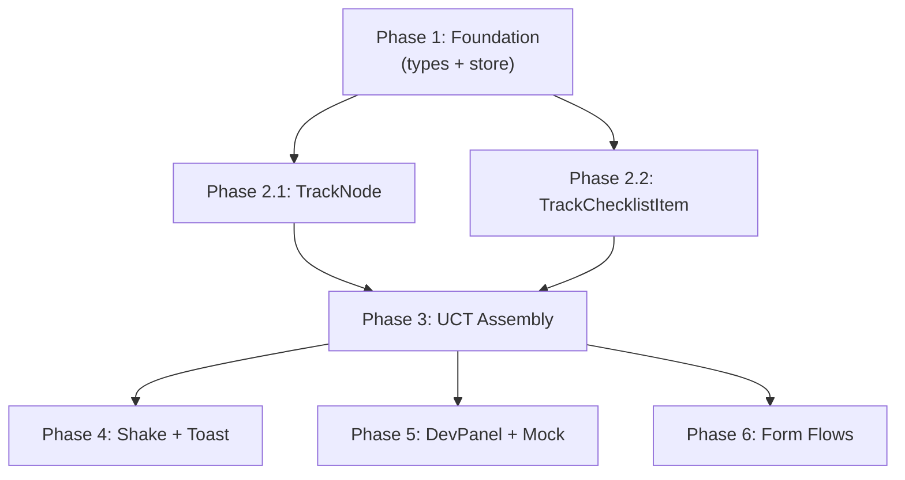

# TIMELINE: Unified Contextual Track (UCT) Implementation

> **Goal:** Replace the disconnected `<SegmentTimeline />` + `<PCSChecklist />` with a single **Unified Contextual Track** — a vertical, state-driven accordion that merges phase nodes, contextual checklist items, and embedded widgets into one progressive-disclosure interface.

---

## 📊 Architecture Delta

### Current State
```
PCSActiveState
├── PCSPhaseWidgets (renders ALL widgets for current phase at top)
├── SegmentTimeline (horizontal-ish segment nodes: COMPLETE → PLANNING → LOCKED)
└── PCSChecklist (flat list grouped by status: action_required → upcoming → completed)
```

### Target State
```
PCSActiveState
└── UnifiedContextualTrack
    ├── TrackNode (phase: "Orders & OBLISERV")       → COMPLETED | ACTIVE | LOCKED
    │   ├── phase-specific checklist items (inline)
    │   └── phase-specific widgets (contextual injection)
    ├── TrackNode (phase: "Logistics & Finances")     → COMPLETED | ACTIVE | LOCKED
    │   ├── <AllowancesCard variant="widget" />
    │   ├── <LeaveImpactWidget />
    │   ├── <HHGWeightGaugeWidget />
    │   └── checklist items (NSIPS, DPS, DLA)
    ├── TrackNode (phase: "Transit & Leave")          → COMPLETED | ACTIVE | LOCKED
    │   ├── <ReceiptScannerWidget /> / <DigitalOrdersWallet />
    │   └── transit checklist items
    └── TrackNode (phase: "Check-in & Travel Claim")  → COMPLETED | ACTIVE | LOCKED
        ├── <BaseWelcomeKit />
        ├── <TravelClaimHUDWidget />
        └── check-in checklist items
```

### Key Architectural Decisions

| Decision | Rationale |
|----------|-----------|
| **Phase-based grouping** over segment-based | The UCT groups by *lifecycle phase*, not by *segment*. A segment (e.g., "C-School IWTC") is a location; a phase (e.g., "Logistics & Finances") is a *state of readiness*. The checklist currently groups by `status`, we need to group by `phase`. |
| **Preserve `SegmentTimeline` as nested** | The segment timeline (Origin → Intermediate → Destination) still makes sense *inside* the active TrackNode as a sub-component showing travel routing. |
| **`usePCSPhase` drives everything** | The existing `derivePhase()` → `usePCSPhase()` hook already computes phase from segment statuses. UCT maps these phases to TrackNode states. |
| **Checklist items need phase assignment** | Current `ChecklistItem.category` is `PRE_TRAVEL | FINANCE | SCREENING`. We need to extend or map this to UCT phases (1–4). |
| **Reanimated v3 Layout Animations** | Already a project dependency. `Layout.springify()` is used in `pcs.tsx`. TrackNode expand/collapse uses `useAnimatedStyle` + `withSpring`. |

---

## 🗺️ Phased Implementation Plan

### PHASE 1: Foundation — Type System & Store Extensions
**Duration:** ~2 hours | **Agent:** Claude Code / Antigravity Opus 4.6

> [!IMPORTANT]  
> This phase blocks ALL others. No UI work can begin until the data model supports phase-grouped checklist items.

#### 1.1 Extend `ChecklistItem` type with UCT phase mapping

**File:** [pcs.ts](file:///Users/matthewclark/Documents/_PERS/My_Compass/My_Compass/types/pcs.ts)

```diff
+export type UCTPhase = 1 | 2 | 3 | 4;
+
+export interface UCTPhaseConfig {
+  phase: UCTPhase;
+  title: string;
+  dateRange?: string;
+  description: string;
+}

 export interface ChecklistItem {
   id: string;
   label: string;
   segmentId?: string;
   status: 'NOT_STARTED' | 'IN_PROGRESS' | 'COMPLETE';
   category: 'PRE_TRAVEL' | 'FINANCE' | 'SCREENING';
+  uctPhase: UCTPhase;              // Which track node this belongs to
+  completedAt?: string;            // ISO timestamp for "Win" receipt display
+  actionRoute?: string;            // Deep link to wizard (e.g., "/pcs-wizard/financials/advance-pay")
 }
```

#### 1.2 Add UCT phase config constant

**File:** [NEW] `constants/UCTPhases.ts`

Define the 4-phase configuration with titles, descriptions, and date-range formulas relative to `reportNLT`.

#### 1.3 Update `initializeOrders()` in `usePCSStore`

**File:** [usePCSStore.ts](file:///Users/matthewclark/Documents/_PERS/My_Compass/My_Compass/store/usePCSStore.ts)

Update checklist item generation (lines 186–234) to assign `uctPhase` values:
- Phase 1 items: Profile Confirmation, OBLISERV Check
- Phase 2 items: Financial Review, NSIPS, HHG, DLA
- Phase 3 items: Segment planning tasks
- Phase 4 items: Check-in, Travel Claim (conditional)

#### 1.4 Add `useUCTPhaseStatus()` computed selector

New hook that maps `usePCSPhase()` → `Record<UCTPhase, 'COMPLETED' | 'ACTIVE' | 'LOCKED'>`, enabling each `TrackNode` to derive its state from the store.

---

### PHASE 2: Core UI — TrackNode Component
**Duration:** ~3 hours | **Agent:** Antigravity Opus 4.6 Thinking

> [!TIP]  
> This is the hero component. It must feel premium — Reanimated v3 spring animations for expand/collapse, haptic feedback on locked tap, toast integration.

#### 2.1 Create `TrackNode` component

**File:** [NEW] `components/pcs/track/TrackNode.tsx`

**Architecture:**
- **Left column:** Vertical track line + status icon (✅ green check / 🔵 pulsing active / 🔒 locked padlock)
- **Right column:** Title, date range, expandable content area
- **States:** `COMPLETED` (muted, collapsed, read-only), `ACTIVE` (elevated, auto-expanded), `LOCKED` (grayed, collapsed, shake on tap)
- **Animation:** `useAnimatedStyle` with `withSpring` for height, `Layout.springify()` for layout shifts
- **Haptics:** `expo-haptics` `Warning` feedback on locked tap, `Light` on completed expand

**Props:**
```typescript
interface TrackNodeProps {
  phase: UCTPhase;
  title: string;
  dateRange?: string;
  status: 'COMPLETED' | 'ACTIVE' | 'LOCKED';
  isLast?: boolean;
  children?: React.ReactNode;
}
```

#### 2.2 Create `ChecklistItem` display component

**File:** [NEW] `components/pcs/track/TrackChecklistItem.tsx`

Pressable checkbox row with:
- Status icon (empty circle → filled check)
- Label text (strikethrough when complete)
- Optional `actionRoute` deep link (ChevronRight affordance)
- Completion receipt text (e.g., "Completed Oct 12" when `completedAt` exists)

#### 2.3 Style tokens

Leverage existing NativeWind classes. Define any new tokens in [tailwind.config.js](file:///Users/matthewclark/Documents/_PERS/My_Compass/My_Compass/tailwind.config.js) if needed (e.g., `navy-blue`, `bg-glass-card`). Review existing color system before adding.

---

### PHASE 3: Orchestration — UnifiedContextualTrack Assembly
**Duration:** ~2 hours | **Agent:** Antigravity Opus 4.6 Thinking + ChatGPT Codex

#### 3.1 Create `UnifiedContextualTrack` orchestrator

**File:** [NEW] `components/pcs/track/UnifiedContextualTrack.tsx`

This component:
1. Reads `usePCSStore` checklist and groups items by `uctPhase`
2. Reads phase status via `useUCTPhaseStatus()`
3. Renders 4 `<TrackNode>` instances
4. **Contextually injects** existing widgets inside the active node:
   - Phase 1 → `<ObliservBanner />`, `<GainingCommandCard />`
   - Phase 2 → `<AllowancesCard variant="widget" />`, `<LeaveImpactWidget />`, `<HHGWeightGaugeWidget />`
   - Phase 3 → `<ReceiptScannerWidget />`, `<DigitalOrdersWallet />`
   - Phase 4 → `<BaseWelcomeKit />`, `<TravelClaimHUDWidget />`, `<LiquidationTrackerWidget />`
5. Renders checklist items per phase

#### 3.2 Refactor `PCSActiveState` to use UCT

**File:** [PCSActiveState.tsx](file:///Users/matthewclark/Documents/_PERS/My_Compass/My_Compass/components/pcs/states/PCSActiveState.tsx)

```diff
-import { PCSChecklist } from '@/components/pcs/PCSChecklist';
-import { SegmentTimeline } from '@/components/pcs/SegmentTimeline';
-import { PCSPhaseWidgets } from '@/components/pcs/widgets/PCSPhaseWidgets';
+import { UnifiedContextualTrack } from '@/components/pcs/track/UnifiedContextualTrack';

 export function PCSActiveState() {
     return (
         <Animated.View ...>
             <View style={{ paddingTop: 24 }}>
-                <PCSPhaseWidgets />
-                <SegmentTimeline />
-                <PCSChecklist />
+                <UnifiedContextualTrack />
             </View>
         </Animated.View>
     );
 }
```

#### 3.3 Embed `SegmentTimeline` inside active TrackNode

The existing `<SegmentTimeline />` becomes a sub-component rendered inside the active phase's TrackNode content area, maintaining the segment-level routing display.

---

### PHASE 4: Locked State UX — Toast & Shake
**Duration:** ~1 hour | **Agent:** ChatGPT Codex / Antigravity Gemini Pro

#### 4.1 Shake animation on locked tap

Use `react-native-reanimated` `withSequence` + `withTiming` for a horizontal shake:
```typescript
const shakeX = useSharedValue(0);
const shake = () => {
  shakeX.value = withSequence(
    withTiming(-10, { duration: 50 }),
    withTiming(10, { duration: 50 }),
    withTiming(-5, { duration: 50 }),
    withTiming(0, { duration: 50 }),
  );
};
```

#### 4.2 Toast integration

If a toast system exists, use it. Otherwise, create a lightweight `<UCTToast />` component with:
- Slide-in from bottom
- Auto-dismiss after 2.5s
- Message: `"Complete Phase {N} to unlock"`

---

### PHASE 5: PCSDevPanel & Mock Data Updates
**Duration:** ~45 min | **Agent:** Google Jules / ChatGPT Codex

#### 5.1 Update `PCSDevPanel` with phase controls

Add a "UCT Phase" row that directly overrides `useUCTPhaseStatus()` for demo purposes, complementing the existing Travel Phase controls.

#### 5.2 Extend `MockPCSData` checklist items

Update `initializeOrders()` or mock service to generate checklist items with `uctPhase` assignments for all 3 personas (Family Move, Single Sailor, Career Sailor).

---

### PHASE 6: Form Flow Replication (Future Forms)
**Duration:** ~2 hours | **Agent:** Antigravity Opus 4.6

> [!NOTE]  
> Per requirement: "If the user is filling out a form, replicate the Leave Flow design."

The Leave Flow pattern ([request.tsx](file:///Users/matthewclark/Documents/_PERS/My_Compass/My_Compass/app/leave/request.tsx)) uses:
- `WizardStatusBar` (scroll-tracked progress)
- Embedded step components (`Step1Intent`, `Step2Contact`, etc.)
- Floating footer with `LeaveImpactHUD` + `SignatureButton`
- Section `onLayout` tracking + `handleScroll` for active step detection

Any new PCS forms (e.g., DLA Request, NSIPS Update) should:
1. Use the same `WizardStatusBar` component
2. Follow the continuous-scroll pattern with `onLayout` tracking
3. Include a floating footer with contextual HUD data
4. Auto-save drafts via store actions

This phase is **not** part of the UCT build itself but is a design standard for any future form screens spawned from UCT checklist items.

---

## 🤖 AI Toolkit Distribution

### Agent Assignment Matrix

| Phase | Task | Best Agent | Why |
|-------|------|-----------|-----|
| **P1** (Foundation) | Type extensions, store updates, computed selectors | **Claude Code** | Deep store pattern knowledge, type system expertise, blocking work |
| **P2** (TrackNode) | Hero component with animations | **Antigravity Opus 4.6** | Complex UI architecture, edge case handling, Reanimated expertise |
| **P2** (ChecklistItem) | Pressable checkbox with deep links | **ChatGPT Codex** | Simple UI component, utility-level work |
| **P3** (Orchestrator) | UCT assembly + widget injection | **Antigravity Opus 4.6** | Architectural decisions, conditional rendering logic |
| **P3** (Refactor) | PCSActiveState swap | **Claude Code** | Existing codebase familiarity, safe refactor |
| **P4** (Shake/Toast) | Micro-interactions | **ChatGPT Codex** | Animation utilities, small scope |
| **P5** (DevPanel) | Demo controls + mock data | **Google Jules** | Mock data generation, test fixtures |
| **P6** (Form Flow) | Future form screens | **Antigravity Opus 4.6** | Complex wizard patterns |

### Execution Timeline

```
DAY 1 — FOUNDATION (Sequential, ~2 hrs)
┌─────────────────────────────────────────────────┐
│ Claude Code / Antigravity Opus: Phase 1         │
│ ├─ 1.1 Type extensions (ChecklistItem + UCT)    │
│ ├─ 1.2 UCTPhases constant                       │
│ ├─ 1.3 initializeOrders() update                │
│ └─ 1.4 useUCTPhaseStatus() hook                 │
└─────────────────────────────────────────────────┘
          ↓ checkpoint: npx tsc --noEmit ✅

DAY 1 — CORE UI (Parallel, ~3 hrs)
┌─────────────────────────────┐ ┌─────────────────────────────┐
│ Opus 4.6: Phase 2.1         │ │ Codex: Phase 2.2            │
│ TrackNode component         │ │ TrackChecklistItem component │
└─────────────────────────────┘ └─────────────────────────────┘
          ↓ checkpoint: components render in isolation

DAY 2 — ORCHESTRATION (Sequential, ~2 hrs)
┌─────────────────────────────────────────────────┐
│ Opus 4.6: Phase 3                               │
│ ├─ 3.1 UnifiedContextualTrack assembly          │
│ ├─ 3.2 PCSActiveState refactor                  │
│ └─ 3.3 SegmentTimeline embedding                │
└─────────────────────────────────────────────────┘
          ↓ checkpoint: full UCT renders on screen

DAY 2 — POLISH (Parallel, ~1.5 hrs)
┌─────────────────────────────┐ ┌─────────────────────────────┐
│ Codex: Phase 4              │ │ Jules: Phase 5              │
│ Shake + Toast               │ │ DevPanel + Mock Data        │
└─────────────────────────────┘ └─────────────────────────────┘
          ↓ checkpoint: full demo scenario works

DAY 3+ — FORM FLOWS (As-Needed)
┌─────────────────────────────────────────────────┐
│ Opus 4.6: Phase 6                               │
│ New form screens following Leave Flow pattern    │
└─────────────────────────────────────────────────┘
```

### Dependency Graph



---

## ✅ Verification Plan

### Automated
```bash
# After Phase 1 — Types compile
npx tsc --noEmit

# After Phase 3 — Full render
npx expo start --clear
# Navigate to My PCS tab, verify UCT renders

# Store tests (extend existing pattern)
npx jest --watchAll=false __tests__/store/
```

### Manual Verification
1. **Phase state transitions:** Use DevPanel to cycle through `PRE-TRANSFER → IN TRANSIT → ARRIVED ONSTA` and confirm TrackNode states update
2. **Locked tap:** Tap a locked (future) phase node — expect shake animation + toast
3. **Completed phase:** Confirm completed phases are collapsed, muted, show green checkmarks
4. **Active phase:** Confirm active phase is auto-expanded with widgets + checklist inline
5. **Widget injection:** Verify `AllowancesCard`, `LeaveImpactWidget`, etc. render inside correct TrackNode
6. **Deep links:** Tap a checklist item with `actionRoute` — confirm it navigates to the correct wizard screen
7. **Dark mode:** Toggle dark mode and verify all UCT elements adapt

---

## 📁 File Impact Summary

| Action | File | Description |
|--------|------|-------------|
| MODIFY | `types/pcs.ts` | Add `UCTPhase`, extend `ChecklistItem` |
| **NEW** | `constants/UCTPhases.ts` | Phase configuration constant |
| MODIFY | `store/usePCSStore.ts` | `initializeOrders()` uctPhase assignment, `useUCTPhaseStatus()` hook |
| **NEW** | `components/pcs/track/TrackNode.tsx` | Hero accordion node component |
| **NEW** | `components/pcs/track/TrackChecklistItem.tsx` | Pressable checklist row |
| **NEW** | `components/pcs/track/UnifiedContextualTrack.tsx` | Orchestrator component |
| MODIFY | `components/pcs/states/PCSActiveState.tsx` | Replace 3 components → 1 UCT |
| MODIFY | `components/pcs/PCSDevPanel.tsx` | Add UCT phase override controls |
| MODIFY | `constants/MockPCSData.ts` | Extend checklist mock data |
| PRESERVE | `components/pcs/SegmentTimeline.tsx` | Reused inside active TrackNode |
| DEPRECATE | `components/pcs/PCSChecklist.tsx` | Replaced by UCT inline items |
| DEPRECATE | `components/pcs/widgets/PCSPhaseWidgets.tsx` | Logic absorbed into UCT |

---

## 🎯 Success Criteria

1. **Cognitive load = zero:** A Sailor opens the app, sees ONE glowing node with 3–4 items. No scrolling through a 40-item checklist.
2. **Progressive disclosure:** Future phases are locked with clear "don't worry" messaging.
3. **Contextual tools:** Widgets render *inside* the phase they belong to, not above the checklist.
4. **Dopamine hits:** Completed phases show green checkmarks with receipt text.
5. **Premium feel:** Spring animations, haptic feedback, no layout snapping.
6. **Zero regression:** All existing widget components work unchanged (variant="widget" pattern preserved).

---

## 🧠 Implementation Prompts

> Copy-paste these prompts directly into each agent. They are self-contained with full context, constraints, and verification steps. Execute in dependency order (Phase 1 → 2 → 3 → 4/5).

---

### PROMPT 1 — Phase 1: Foundation (Claude Code)
**Run:** DAY 1, Session 1 (Sequential — blocks ALL other prompts)
**Verify:** `npx tsc --noEmit` must pass before launching Prompts 2–3

```
You are implementing Phase 1 (Foundation) of the Unified Contextual Track (UCT) feature for My Compass, a React Native military personnel management app.

PROJECT SETUP:
- React Native 0.81 via Expo SDK 54, TypeScript 5.9 (strict)
- State: Zustand 5, stores in store/use[Feature]Store.ts
- Styling: NativeWind 4 (Tailwind CSS for React Native)
- Icons: Lucide-React-Native only
- Animations: React Native Reanimated 4
- Path alias: @/ for all imports (e.g., @/types, @/store, @/constants)
- NEVER use HTML elements (<div>, <span>, etc.) — React Native primitives only
- NEVER create .css files — use className prop with Tailwind classes

GOAL: Extend the type system and Zustand store so that PCS checklist items are grouped by UCT phase (1–4) instead of just by status. This is the blocking foundation for the entire UCT UI.

============================
TASK 1.1: Extend types/pcs.ts
============================

Add these types BEFORE the existing ChecklistItem interface:

export type UCTPhase = 1 | 2 | 3 | 4;

export type UCTNodeStatus = 'COMPLETED' | 'ACTIVE' | 'LOCKED';

export interface UCTPhaseConfig {
  phase: UCTPhase;
  title: string;
  description: string;
}

Then extend the existing ChecklistItem interface (DO NOT remove existing fields):

export interface ChecklistItem {
  id: string;
  label: string;
  segmentId?: string;
  status: 'NOT_STARTED' | 'IN_PROGRESS' | 'COMPLETE';
  category: 'PRE_TRAVEL' | 'FINANCE' | 'SCREENING';
  uctPhase: UCTPhase;         // NEW — which track node this item belongs to
  completedAt?: string;       // NEW — ISO timestamp for "Win" receipt display
  actionRoute?: string;       // NEW — deep link to wizard (e.g., "/pcs-wizard/financials/advance-pay")
}

IMPORTANT: The existing PCSPhase type is 'DORMANT' | 'ORDERS_NEGOTIATION' | 'TRANSIT_LEAVE' | 'CHECK_IN'. UCTPhase maps to these as:
  UCTPhase 1 → ORDERS_NEGOTIATION
  UCTPhase 2 → TRANSIT_LEAVE (subPhase: PLANNING)
  UCTPhase 3 → TRANSIT_LEAVE (subPhase: ACTIVE_TRAVEL)
  UCTPhase 4 → CHECK_IN

============================
TASK 1.2: Create constants/UCTPhases.ts
============================

Create a new file constants/UCTPhases.ts that exports:

import { UCTPhaseConfig } from '@/types/pcs';

export const UCT_PHASES: UCTPhaseConfig[] = [
  {
    phase: 1,
    title: 'Orders & OBLISERV',
    description: 'Verify orders, confirm OBLISERV, complete screenings.',
  },
  {
    phase: 2,
    title: 'Logistics & Finances',
    description: 'Complete these items before you detach from your current command.',
  },
  {
    phase: 3,
    title: 'Transit & Leave',
    description: 'You are en route. Track receipts and manage travel documents.',
  },
  {
    phase: 4,
    title: 'Check-in & Travel Claim',
    description: 'Report to your new command and file your travel claim.',
  },
];

============================
TASK 1.3: Update initializeOrders() in store/usePCSStore.ts
============================

The current initializeOrders() function (around line 176) generates checklist items WITHOUT uctPhase. Update it so every checklist.push() includes a uctPhase field. Here is the mapping:

Phase 1 items:
  - 'Profile Confirmation' → uctPhase: 1, category: 'PRE_TRAVEL'
  - 'OBLISERV Check' → uctPhase: 1, category: 'PRE_TRAVEL'
  - 'Overseas Screening' (conditional: order.isOconus) → uctPhase: 1, category: 'SCREENING'
  - 'Sea Duty Screening' (conditional: order.isSeaDuty) → uctPhase: 1, category: 'SCREENING'

Phase 2 items:
  - 'Financial Review' → uctPhase: 2, category: 'FINANCE'
  - ADD NEW: 'Update NSIPS Dependency Data (Page 2)' → uctPhase: 2, category: 'PRE_TRAVEL'
  - ADD NEW: 'Schedule Household Goods (DPS)' → uctPhase: 2, category: 'PRE_TRAVEL', actionRoute: '/pcs-wizard/hhg'
  - ADD NEW: 'Submit DLA / Advance Pay Request' → uctPhase: 2, category: 'FINANCE', actionRoute: '/pcs-wizard/financials/advance-pay'

Phase 3 items:
  - Segment planning tasks (the forEach loop) → uctPhase: 3

Phase 4 items:
  - ADD NEW: 'Complete Gaining Command Check-In' → uctPhase: 4, category: 'PRE_TRAVEL'
  - ADD NEW: 'File DD 1351-2 Travel Claim' → uctPhase: 4, category: 'FINANCE', actionRoute: '/pcs-wizard/travel-claim'

PRESERVE all existing logic. Only add the uctPhase field to existing items and add the new items listed above.

============================
TASK 1.4: Add useUCTPhaseStatus() hook in store/usePCSStore.ts
============================

Add this new exported hook AFTER the existing useSubPhase() hook (around line 775):

/**
 * Computed UCT phase status selector.
 * Maps from PCSPhase + TRANSITSubPhase → Record<UCTPhase, UCTNodeStatus>.
 * Determines which TrackNode is COMPLETED, ACTIVE, or LOCKED.
 */
export const useUCTPhaseStatus = (): Record<UCTPhase, UCTNodeStatus> => {
  const phase = usePCSPhase();
  const subPhase = useSubPhase();

  return useMemo(() => {
    // Map PCSPhase → active UCT phase number
    let activeUCT: UCTPhase;
    switch (phase) {
      case 'ORDERS_NEGOTIATION': activeUCT = 1; break;
      case 'TRANSIT_LEAVE':
        activeUCT = subPhase === 'ACTIVE_TRAVEL' ? 3 : 2;
        break;
      case 'CHECK_IN': activeUCT = 4; break;
      default: activeUCT = 1; // DORMANT defaults to phase 1
    }

    return {
      1: activeUCT > 1 ? 'COMPLETED' : activeUCT === 1 ? 'ACTIVE' : 'LOCKED',
      2: activeUCT > 2 ? 'COMPLETED' : activeUCT === 2 ? 'ACTIVE' : 'LOCKED',
      3: activeUCT > 3 ? 'COMPLETED' : activeUCT === 3 ? 'ACTIVE' : 'LOCKED',
      4: activeUCT === 4 ? 'ACTIVE' : 'LOCKED', // Phase 4 is never "COMPLETED" in active orders
    } as Record<UCTPhase, UCTNodeStatus>;
  }, [phase, subPhase]);
};

You'll need to import UCTPhase and UCTNodeStatus from '@/types/pcs'.

============================
VERIFICATION:
============================
After all changes:
1. Run: npx tsc --noEmit  — must pass with zero errors
2. Run: npx jest --watchAll=false __tests__/store/  — existing tests must pass
3. Verify the new UCT_PHASES constant exports correctly

CONSTRAINTS:
- Do NOT modify any component files (no .tsx changes)
- Do NOT delete any existing types or store fields
- Do NOT rename any existing exports
- Preserve the existing persist() middleware configuration
- Use the generateUUID() helper already in the file for new checklist item IDs
```

---

### PROMPT 2 — Phase 2.1: TrackNode Component (Antigravity Opus 4.6 Thinking)
**Run:** DAY 1, Session 2 (after Phase 1 checkpoint passes)  
**Parallel with:** Prompt 3

```
You are implementing the hero TrackNode component for the Unified Contextual Track (UCT) in My Compass, a React Native military personnel management app.

PROJECT CONSTRAINTS:
- React Native 0.81 via Expo SDK 54, TypeScript 5.9 (strict)
- Styling: NativeWind 4 (Tailwind className prop) — NO CSS files, NO styled-components
- Icons: Lucide-React-Native ONLY (import from 'lucide-react-native')
- Animations: React Native Reanimated 4 (useAnimatedStyle, withSpring, withTiming, withSequence, Layout, FadeIn, useSharedValue)
- Haptics: expo-haptics (guard with Platform.OS !== 'web')
- NEVER use HTML (<div>, <span>, etc.) — React Native primitives only (<View>, <Text>, <Pressable>)
- Path alias: @/ (e.g., @/types/pcs, @/components/useColorScheme)
- Dark mode: use useColorScheme() from '@/components/useColorScheme', apply dark: prefix classes

TYPES AVAILABLE (from @/types/pcs — already implemented in Phase 1):

export type UCTPhase = 1 | 2 | 3 | 4;
export type UCTNodeStatus = 'COMPLETED' | 'ACTIVE' | 'LOCKED';

EXISTING PATTERN TO FOLLOW:
The SegmentTimeline component (components/pcs/SegmentTimeline.tsx) uses a similar vertical timeline with left-column icons and right-column content. Study its layout:
- Left column: 32x32 rounded-full icons with border-2, vertical connecting line (w-[2px])
- Right column: Pressable content cards
- Status-based styling (COMPLETE → blue bg, PLANNING → blue border, LOCKED → gray)

The PCS landing page (app/(tabs)/(pcs)/pcs.tsx) already uses Layout.springify() for smooth layout animations.

============================
CREATE: components/pcs/track/TrackNode.tsx
============================

Build a TrackNode component with these specifications:

PROPS:
interface TrackNodeProps {
  phase: UCTPhase;
  title: string;
  dateRange?: string;
  status: UCTNodeStatus;  // 'COMPLETED' | 'ACTIVE' | 'LOCKED'
  isLast?: boolean;
  children?: React.ReactNode;  // Widgets + checklist items injected by parent
}

LAYOUT (Two-Column):
LEFT COLUMN (track line + icon):
  - 40x40 rounded-full icon container
  - COMPLETED state: bg-green-500, white CheckCircle icon (from lucide-react-native), size 20
  - ACTIVE state: bg-blue-700 dark:bg-blue-600, gold MapPin icon (size 18), border-2 border-blue-200, shadow-md
  - LOCKED state: bg-slate-200 dark:bg-slate-700, gray Lock icon (size 16)
  - Vertical connecting line: w-1 (4px) between nodes, bg-green-500 for completed segments, bg-slate-200 dark:bg-slate-700 for others
  - Line must extend from bottom of icon to top of next node's icon
  - If isLast, do NOT render the vertical line

RIGHT COLUMN (content card):
  - Title: text-xl font-black
    - LOCKED: text-slate-400 dark:text-slate-500
    - ACTIVE/COMPLETED: text-slate-900 dark:text-white
  - Date range: text-sm text-slate-500 font-medium (only if dateRange provided)
  - Expandable content area (children)

STATES:
1. COMPLETED:
   - Entire node at opacity 60% (opacity-60 class or style={{ opacity: 0.6 }})
   - Collapsed by default (content area hidden)
   - On tap: smoothly expand to show read-only receipt (toggle with local useState)
   - Haptic: Haptics.impactAsync(Haptics.ImpactFeedbackStyle.Light) on expand
   - No animated height — just conditional render with FadeIn entering animation

2. ACTIVE:
   - Full opacity, elevated appearance
   - Auto-expanded on mount (content area always visible)
   - Content wrapped in a glass-style card:
     className="bg-white/95 dark:bg-slate-800/90 rounded-2xl p-5 border border-slate-200/50 dark:border-slate-700/50 shadow-sm"
   - Render {children} inside this card

3. LOCKED:
   - Entire node at 50% opacity
   - Content area hidden (no children rendered)
   - On tap: trigger shake animation + haptic warning
   - Shake animation using useSharedValue + withSequence:
     translateX: -10 → 10 → -5 → 0 (duration 50ms each via withTiming)
   - Haptic: Haptics.notificationAsync(Haptics.NotificationFeedbackType.Warning)
   - After shake: show a toast message "Complete Phase {N-1} to unlock" (use a local state that auto-dismisses after 2.5s, rendered as a small Text below the title)

ANIMATION:
- Wrap the entire TrackNode in <Animated.View layout={Layout.springify().damping(15)}>
- Content expand/collapse: Use FadeIn.delay(150) entering animation on the content card (no complex height animation — just conditional render with entering)
- Shake: Apply useAnimatedStyle with transform: [{ translateX: shakeX.value }] to the right-column Pressable

FULL COMPONENT SIGNATURE:
export function TrackNode({ phase, title, dateRange, status, isLast, children }: TrackNodeProps)

============================
VERIFICATION:
============================
1. Component must compile: npx tsc --noEmit
2. Test rendering in isolation by temporarily importing into PCSActiveState:
   <TrackNode phase={1} title="Test" status="ACTIVE"><Text>Content</Text></TrackNode>
   <TrackNode phase={2} title="Test 2" status="LOCKED" />
   <TrackNode phase={3} title="Test 3" status="COMPLETED" isLast />
3. Verify: ACTIVE node renders expanded with children, LOCKED node shakes on tap, COMPLETED node toggles on tap
4. Verify dark mode renders correctly
5. Verify haptics fire on physical device/simulator (not web)
```

---

### PROMPT 3 — Phase 2.2: TrackChecklistItem Component (ChatGPT 5.3-codex)
**Run:** DAY 1, Session 2 (parallel with Prompt 2)

```
You are implementing a TrackChecklistItem component for the My Compass React Native app.

PROJECT CONSTRAINTS:
- React Native 0.81, Expo SDK 54, TypeScript 5.9 (strict)
- Styling: NativeWind 4 — use className prop with Tailwind classes, NO CSS files
- Icons: Lucide-React-Native ONLY
- Haptics: expo-haptics (guard with Platform.OS !== 'web' before calling)
- Navigation: expo-router (use useRouter from 'expo-router')
- Path alias: @/ for all imports
- NEVER use HTML elements — React Native primitives only

TYPES (from @/types/pcs):

export interface ChecklistItem {
  id: string;
  label: string;
  segmentId?: string;
  status: 'NOT_STARTED' | 'IN_PROGRESS' | 'COMPLETE';
  category: 'PRE_TRAVEL' | 'FINANCE' | 'SCREENING';
  uctPhase: 1 | 2 | 3 | 4;
  completedAt?: string;
  actionRoute?: string;
}

EXISTING PATTERN — Study the checkbox rendering in components/pcs/PCSChecklist.tsx:
- 20x20 rounded-full border circle
- Complete: bg-green-500 border-green-500, white Check icon (size 12)
- Not complete + action required: border-blue-500, blue dot inside (w-2.5 h-2.5 bg-blue-500)
- Default: border-slate-300 dark:border-slate-600

============================
CREATE: components/pcs/track/TrackChecklistItem.tsx
============================

Props:
interface TrackChecklistItemProps {
  item: ChecklistItem;
  onToggle: (id: string) => void;
}

Behavior:
1. Pressable row with flex-row layout, items-center, padding p-3
2. LEFT: Status circle (same pattern as PCSChecklist above)
3. CENTER (flex-1):
   - Label text: text-base font-medium
     - If COMPLETE: text-slate-400 line-through
     - Else: text-slate-900 dark:text-white
   - If item.completedAt exists and status is COMPLETE:
     Render below the label: text-xs text-green-600 dark:text-green-400
     Format: "Completed {date}" using new Date(item.completedAt).toLocaleDateString(undefined, { month: 'short', day: 'numeric' })
   - Category badge: text-xs text-slate-400 uppercase mt-0.5
     Display item.category with underscores replaced by spaces
4. RIGHT: If item.actionRoute exists AND status is NOT 'COMPLETE':
   - Render ChevronRight icon (size 16, color blue-600/blue-400 dark)
   - On press: router.push(item.actionRoute)
5. Main onPress behavior:
   - If status is COMPLETE: do nothing (read-only receipt)
   - If item.actionRoute exists: router.push(item.actionRoute) — navigate, don't toggle
   - Else: call onToggle(item.id) — toggle completion
   - Haptic: Haptics.impactAsync(Haptics.ImpactFeedbackStyle.Light) on any press
6. Bottom border: Add a thin bottom border (border-b border-slate-100 dark:border-slate-700/50) unless it's the last item (let the parent handle this — don't worry about isLast)

Use useColorScheme from '@/components/useColorScheme' for dark mode detection.

export function TrackChecklistItem({ item, onToggle }: TrackChecklistItemProps)

VERIFICATION:
1. npx tsc --noEmit — must pass
2. Renders correctly in isolation with mock ChecklistItem data
3. Tap behavior: navigates when actionRoute exists, toggles when not
4. Completed items show receipt date and strikethrough
```

---

### PROMPT 4 — Phase 3: UnifiedContextualTrack + PCSActiveState Refactor (Antigravity Opus 4.6 Thinking)
**Run:** DAY 2, Session 1 (after Phase 2 components are verified)  
**Depends on:** Prompts 1, 2, 3 all completed

```
You are implementing the UnifiedContextualTrack orchestrator and refactoring PCSActiveState for My Compass, a React Native military app.

PROJECT CONSTRAINTS:
- React Native 0.81, Expo SDK 54, TypeScript 5.9 (strict)
- Styling: NativeWind 4 (className prop with Tailwind classes)
- Icons: Lucide-React-Native ONLY
- Animations: React Native Reanimated 4
- NEVER use HTML elements — React Native primitives only
- Path alias: @/ for all imports

PREREQUISITE: These files already exist from previous phases:
- types/pcs.ts — has UCTPhase, UCTNodeStatus, extended ChecklistItem with uctPhase field
- constants/UCTPhases.ts — exports UCT_PHASES array with 4 phase configs
- store/usePCSStore.ts — has useUCTPhaseStatus() hook returning Record<UCTPhase, UCTNodeStatus>
- components/pcs/track/TrackNode.tsx — accordion node with COMPLETED/ACTIVE/LOCKED states
- components/pcs/track/TrackChecklistItem.tsx — pressable checklist row

EXISTING WIDGETS (all already exist, import from these exact paths):
- @/components/pcs/financials/ObliservBanner — props: variant="widget"
- @/components/pcs/widgets/GainingCommandCard — props: variant="widget"
- @/components/pcs/financials/AllowancesCard — props: variant="widget"
- @/components/pcs/widgets/LeaveImpactWidget — no props needed
- @/components/pcs/widgets/HHGWeightGaugeWidget — no props needed
- @/components/pcs/widgets/ReceiptScannerWidget — no props needed
- @/components/pcs/widgets/DigitalOrdersWallet — no props needed
- @/components/pcs/widgets/BaseWelcomeKit — no props needed
- @/components/pcs/widgets/TravelClaimHUDWidget — no props needed
- @/components/pcs/widgets/LiquidationTrackerWidget — no props needed
- @/components/pcs/SegmentTimeline — no props needed (reads from usePCSStore internally)

EXISTING STORE HOOKS:
- usePCSStore — main store, use selector: (state) => state.checklist
- usePCSStore — action: (state) => state.setChecklistItemStatus
- useUCTPhaseStatus() — returns Record<UCTPhase, UCTNodeStatus>
- usePCSPhase() — returns current PCSPhase
- useSubPhase() — returns current TRANSITSubPhase

============================
TASK 3.1: CREATE components/pcs/track/UnifiedContextualTrack.tsx
============================

This is the orchestrator component. It:

1. READS checklist from store and GROUPS items by uctPhase:
   const checklist = usePCSStore((state) => state.checklist);
   const setStatus = usePCSStore((state) => state.setChecklistItemStatus);
   const phaseStatuses = useUCTPhaseStatus();

   Group: create a Record<UCTPhase, ChecklistItem[]> by filtering checklist items per phase.

2. HANDLES toggle:
   const handleToggle = (id: string) => {
     const item = checklist.find(i => i.id === id);
     if (!item) return;
     const newStatus = item.status === 'COMPLETE' ? 'NOT_STARTED' : 'COMPLETE';
     setStatus(id, newStatus);
   };

3. RENDERS 4 TrackNode instances using UCT_PHASES config:
   Import UCT_PHASES from '@/constants/UCTPhases'.
   Map over UCT_PHASES and render:

   <TrackNode
     key={config.phase}
     phase={config.phase}
     title={config.title}
     status={phaseStatuses[config.phase]}
     isLast={config.phase === 4}
   >
     {/* Widget injection + Checklist items */}
   </TrackNode>

4. INJECTS WIDGETS inside each TrackNode's children, ONLY when that node is ACTIVE:
   Phase 1 (ACTIVE): <ObliservBanner variant="widget" />, <GainingCommandCard variant="widget" />
   Phase 2 (ACTIVE): <AllowancesCard variant="widget" />, <LeaveImpactWidget />, <HHGWeightGaugeWidget />
   Phase 3 (ACTIVE): <SegmentTimeline />, <ReceiptScannerWidget />, <DigitalOrdersWallet />
   Phase 4 (ACTIVE): <BaseWelcomeKit />, <TravelClaimHUDWidget />, <LiquidationTrackerWidget />

   When a phase is COMPLETED, only render the checklist items (no widgets) inside the expanded view.
   When LOCKED, TrackNode handles hiding children internally.

5. RENDERS CHECKLIST ITEMS per phase:
   After widgets, render each ChecklistItem for that phase:
   {(phaseItems[config.phase] || []).map(item => (
     <TrackChecklistItem key={item.id} item={item} onToggle={handleToggle} />
   ))}

6. WRAP in Animated.View with entering={FadeIn.duration(400)} and layout={Layout.springify().damping(15)}

Component structure:
- Header text: "My PCS Journey" — text-2xl font-black text-slate-900 dark:text-white px-4 mb-6
- 4 TrackNode instances

export function UnifiedContextualTrack()

============================
TASK 3.2: MODIFY components/pcs/states/PCSActiveState.tsx
============================

CURRENT FILE (33 lines):
import { PCSChecklist } from '@/components/pcs/PCSChecklist';
import { SegmentTimeline } from '@/components/pcs/SegmentTimeline';
import { PCSPhaseWidgets } from '@/components/pcs/widgets/PCSPhaseWidgets';
import React from 'react';
import { View } from 'react-native';
import Animated, { FadeIn, FadeOut } from 'react-native-reanimated';

export function PCSActiveState() {
    return (
        <Animated.View
            entering={FadeIn.duration(400)}
            exiting={FadeOut.duration(200)}
        >
            <View style={{ paddingTop: 24 }}>
                <PCSPhaseWidgets />
                <SegmentTimeline />
                <PCSChecklist />
            </View>
        </Animated.View>
    );
}

REPLACE WITH:
import { UnifiedContextualTrack } from '@/components/pcs/track/UnifiedContextualTrack';
import React from 'react';
import { View } from 'react-native';
import Animated, { FadeIn, FadeOut } from 'react-native-reanimated';

export function PCSActiveState() {
    return (
        <Animated.View
            entering={FadeIn.duration(400)}
            exiting={FadeOut.duration(200)}
        >
            <View style={{ paddingTop: 24 }}>
                <UnifiedContextualTrack />
            </View>
        </Animated.View>
    );
}

Do NOT delete PCSChecklist.tsx, SegmentTimeline.tsx, or PCSPhaseWidgets.tsx — they are preserved for potential standalone use. Only remove their imports from PCSActiveState.

============================
VERIFICATION:
============================
1. npx tsc --noEmit — must pass
2. Run the app: npx expo start --clear
3. Navigate to My PCS tab (must be in demo mode with active orders)
4. Verify:
   - 4 TrackNodes render vertically
   - Active phase is expanded with widgets + checklist items
   - Locked phases are grayed with padlock icons
   - Completed phases are muted with green checkmarks
   - Tapping a completed phase toggles its expanded content
   - Tapping a locked phase triggers shake + message
   - SegmentTimeline renders inside Phase 3 when active
5. Test with DevPanel phase overrides (PRE-TRANSFER, IN TRANSIT, ARRIVED ONSTA)
6. Verify dark mode
```

---

### PROMPT 5 — Phase 4: Toast System (ChatGPT 5.3-codex)
**Run:** DAY 2, Session 2 (parallel with Prompt 6)  
**Depends on:** Prompt 4

```
You are creating a lightweight toast notification system for the My Compass React Native app. This toast is triggered when a user taps a locked UCT phase node.

PROJECT CONSTRAINTS:
- React Native 0.81, Expo SDK 54, TypeScript 5.9 (strict)
- Styling: NativeWind 4 (className prop with Tailwind)
- Animations: React Native Reanimated 4
- NEVER use HTML elements — React Native primitives only
- Path alias: @/ for all imports
- Dark mode support required (useColorScheme from '@/components/useColorScheme')

============================
CREATE: components/ui/UCTToast.tsx
============================

A simple, self-contained toast component that slides in from the bottom and auto-dismisses.

Props:
interface UCTToastProps {
  message: string;
  visible: boolean;
  onDismiss: () => void;
  duration?: number;  // default 2500ms
}

Behavior:
1. When visible becomes true:
   - Slide up from bottom (translateY animation: from 100 to 0, withSpring, damping 20)
   - Opacity: from 0 to 1 (withTiming, 200ms)
2. Auto-dismiss after duration ms:
   - useEffect with setTimeout calling onDismiss()
   - Clean up timer on unmount
3. Visual:
   - Position: absolute, bottom: 60, left/right: 16 (for safe area), z-50
   - Background: bg-slate-900 dark:bg-slate-100 (inverted for contrast)
   - Text: text-white dark:text-slate-900, text-sm font-semibold, text-center
   - Rounded: rounded-xl
   - Padding: px-5 py-3.5
   - Shadow: shadow-lg
4. If visible is false, return null (unmount fully)

export function UCTToast({ message, visible, onDismiss, duration = 2500 }: UCTToastProps)

============================
INTEGRATION NOTE:
============================
The TrackNode component (components/pcs/track/TrackNode.tsx) already handles locked-tap state internally with a local message. If the team decides to use this UCTToast instead:

The invoking pattern would be:
const [toastMsg, setToastMsg] = useState<string | null>(null);

// In locked press handler:
setToastMsg(`Complete Phase ${phase - 1} to unlock`);

// In render:
<UCTToast
  message={toastMsg || ''}
  visible={!!toastMsg}
  onDismiss={() => setToastMsg(null)}
/>

But for now, create this as a standalone reusable component. The team will integrate it.

VERIFICATION:
1. npx tsc --noEmit — must pass
2. Test by rendering in any screen:
   <UCTToast message="Test toast" visible={true} onDismiss={() => {}} />
3. Verify slide-up animation, auto-dismiss after 2.5s, dark mode styling
```

---

### PROMPT 6 — Phase 5: DevPanel Updates + Mock Data (Google Jules)
**Run:** DAY 2, Session 2 (parallel with Prompt 5)  
**Depends on:** Prompt 4

```
You are updating the PCS developer panel and mock data for the My Compass React Native app to support the new Unified Contextual Track (UCT) feature.

PROJECT CONSTRAINTS:
- React Native 0.81, TypeScript 5.9 (strict)
- Path alias: @/ for imports
- NEVER use HTML elements — React Native primitives only
- NativeWind 4 for styling (className prop)

TYPES (from @/types/pcs):
export type UCTPhase = 1 | 2 | 3 | 4;

============================
TASK 5.1: UPDATE components/pcs/PCSDevPanel.tsx
============================

The existing PCSDevPanel has controls for View Mode (ACTIVE/ARCHIVE), Travel Phase (PRE-TRANSFER/IN TRANSIT/ARRIVED ONSTA), and Transit Sub-Phase (PLANNING/EN ROUTE).

ADD a new row of controls for "UCT Phase Override" that allows directly overriding which UCT phase is active. This is useful for demoing specific phases without needing to change segment statuses.

The existing pattern uses:
- useDemoStore state for overrides
- TouchableOpacity buttons in a flex-row flex-wrap gap-2 justify-center layout
- Active state: colored background + white text
- Inactive state: transparent bg + gray text + border

You need to:
1. Add to useDemoStore (store/useDemoStore.ts):
   - New state: uctPhaseOverride: UCTPhase | null (default null)
   - New action: setUctPhaseOverride: (phase: UCTPhase | null) => void

2. Add a "UCT Phase" button row in PCSDevPanel after the Transit Sub-Phase section:
   - 4 buttons labeled: "Phase 1", "Phase 2", "Phase 3", "Phase 4"
   - Toggle behavior: tap to activate, tap again to deactivate (set to null)
   - Active style: bg-purple-500 border-purple-600, white text
   - Section label: "UCT Phase" in the same text-[10px] font-semibold style

3. Update useUCTPhaseStatus() in store/usePCSStore.ts to respect this override:
   Check if isDemoMode && uctPhaseOverride exists, and if so, set activeUCT = uctPhaseOverride.
   This requires importing useDemoStore lazily (same pattern as usePCSPhase uses).

============================
TASK 5.2: VERIFY MockPCSData checklist items
============================

The initializeOrders() function in usePCSStore.ts now generates checklist items with uctPhase fields. Verify that when using each persona (demo-user-1, demo-user-2, demo-user-3), the checklist items generate correctly:

Persona A (Family Move — OCONUS, Sea Duty):
  Phase 1: Profile Confirmation, OBLISERV Check, Overseas Screening, Sea Duty Screening (4 items)
  Phase 2: Financial Review, NSIPS, HHG, DLA (4 items)
  Phase 3: 3 segment planning items (3 segments)
  Phase 4: Check-In, Travel Claim (2 items)
  Total: 13 items

Persona B (Single Sailor — CONUS, Shore):
  Phase 1: Profile Confirmation, OBLISERV Check (2 items)
  Phase 2: Financial Review, NSIPS, HHG, DLA (4 items)
  Phase 3: 2 segment planning items (2 segments)
  Phase 4: Check-In, Travel Claim (2 items)
  Total: 10 items

Persona C (Career Sailor — CONUS, Sea Duty):
  Phase 1: Profile Confirmation, OBLISERV Check, Sea Duty Screening (3 items)
  Phase 2: Financial Review, NSIPS, HHG, DLA (4 items)
  Phase 3: 2 segment planning items (2 segments)
  Phase 4: Check-In, Travel Claim (2 items)
  Total: 11 items

If the counts don't match, fix the initializeOrders() logic.

VERIFICATION:
1. npx tsc --noEmit
2. Run the app, enable demo mode, cycle through UCT Phase 1–4 buttons
3. Verify each phase override correctly sets the active TrackNode
4. Switch personas and verify checklist item counts per phase
```

---

### PROMPT 7 — Phase 6: Form Flow Standard (Antigravity Opus 4.6 Thinking)
**Run:** DAY 3+ (as-needed, when building new PCS form screens)

```
You are implementing a new PCS form screen for My Compass, a React Native military app. This form MUST replicate the "Leave Flow" design pattern established in app/leave/request.tsx.

PROJECT CONSTRAINTS:
- React Native 0.81, Expo SDK 54, TypeScript 5.9 (strict)
- Styling: NativeWind 4 (className prop)
- Navigation: Expo Router 6 (file-based routing)
- State: Zustand 5
- Animations: React Native Reanimated 4
- NEVER use HTML — React Native primitives only

============================
LEAVE FLOW PATTERN (from app/leave/request.tsx):
============================

The Leave Flow is a single-page continuous-scroll wizard with these key elements:

1. STICKY HEADER with WizardStatusBar:
   - Component: @/components/wizard/WizardStatusBar
   - Props: currentStep (number), onStepPress (callback), errorSteps (number[])
   - Label above: "LEAVE FLOW" (text-[11px], font-semibold, tracking-[1.5px], uppercase)
   - Sticky at top with bg-white/95 dark:bg-slate-900/95

2. SCROLL-TRACKED STEPS:
   - Uses useRef<any>(scrollViewRef) and useRef<number[]>(sectionCoords)
   - Each section gets onLayout={(e) => handleSectionLayout(index, e)} to record Y position
   - handleScroll reads contentOffset.y and determines activeStep by comparing against sectionCoords
   - scrollToSection(index) scrolls to the recorded Y position

3. EMBEDDED STEP COMPONENTS:
   - Each step is a separate component: <Step1Intent />, <Step2Contact />, etc.
   - All receive an embedded={true} prop
   - Wrapped in <View onLayout={...} className="mb-6">

4. FLOATING FOOTER:
   - Position: absolute, bottom: 0, left/right: 0
   - Contains contextual HUD data (e.g., LeaveImpactHUD showing calculations)
   - Action button(s) (e.g., SignatureButton for submit, X button for exit)
   - Padding: paddingBottom: Math.max(insets.bottom, 20)
   - Border top: border-t border-slate-200 dark:border-slate-800

5. AUTO-SAVE DRAFTS:
   - 800ms debounced useEffect that creates/updates drafts via store actions
   - Draft resume on mount (check for existing draftId)

6. VALIDATION:
   - validateStep(index) function per step
   - stepErrors array tracks incomplete steps behind the current step
   - Submit validates all steps, scrolls to first error if any fail

7. EXIT FLOW:
   - X button triggers confirmation modal (Save Draft / Discard / Cancel)
   - Uses BlurView background

8. SUCCESS CELEBRATION:
   - Full-screen overlay with BlurView, CheckCircle icon (ZoomIn), "Request Sent!" text
   - Auto-navigates back after 2.5s

============================
WHEN BUILDING A NEW PCS FORM:
============================

Replace [FORM_NAME] with the actual form name (e.g., "DLA Request", "NSIPS Update"):

1. Create app/pcs-wizard/[form-name].tsx
2. Replicate the EXACT structure from request.tsx:
   - WizardStatusBar header with "[FORM_NAME] FLOW" label
   - ScrollView with onScroll={handleScroll} and scrollEventThrottle={16}
   - Step components with onLayout tracking
   - Floating footer with relevant HUD + submit/exit buttons
   - Auto-save to usePCSStore or dedicated store
3. Use useFocusEffect to hide the global header (same pattern as request.tsx)
4. KeyboardAvoidingView with Platform.OS === 'ios' ? 'padding' : 'height'
5. SafeAreaView edges={['top']}
6. Dark mode support with LinearGradient for dark backgrounds

FORM-SPECIFIC DELIVERABLES:
- Step components in components/pcs/wizard/[FormName]Step[N].tsx
- Zod validation schema in types/pcs.ts or a new types/[form-name].ts
- Store actions for draft management
- HUD component for the floating footer showing relevant calculations

This prompt is a TEMPLATE. When you receive a specific form to build, follow this pattern exactly and adapt the step content to the form's requirements.
```

---

**End of Prompts**

**Generated by:** Antigravity (Claude Opus 4.6 Thinking)  
**Date:** 2026-02-14  
**Codebase State:** Post-Phase 5 DORMANT implementation, pre-UCT  
